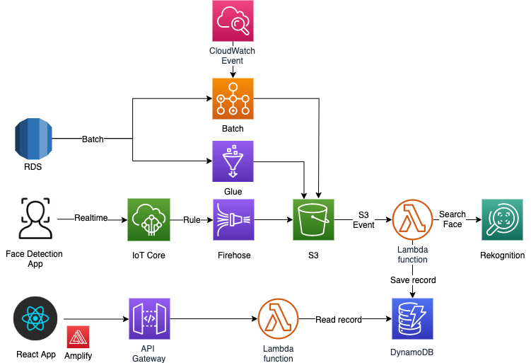
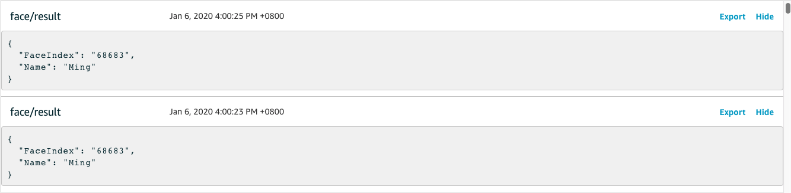
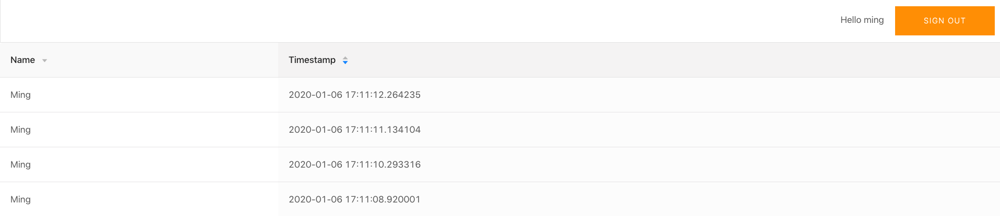
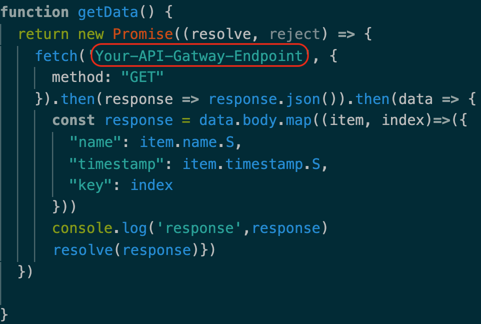
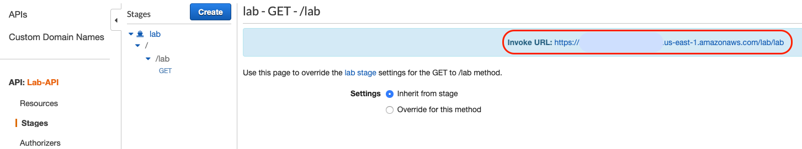

# aws-face-recognition
This workshop let you use AWS resources to build a complete face recognition application.

## Prerequisite
This workshop requires the following:
- AWS Account with sufficient privileges
- Computer/Laptop and webcam 
- Python library
    - python-opencv
    - dlib
    - boto3
    - awscli
    ``` 
    pip install -r requirement.txt 
    ```
- NodeJs & npm
    - [Download from here](https://nodejs.org/)

## Overview
- AWS architecture



- Recognition result on **AWS IoT**
   
    

- Recognition result on a react website

    

## Build a face recognition app
- AWS Credential Configure
    - Enter access id, secret access key, default region name, default output format
```
aws configure
```
- Cloudformation template (This will build AWS resources)
    - Open AWS console
    - Go to **S3**
        - Click create bucket
        - Enter a **unique** bucket name
        - Click **create**
        - Upload `lambda_script` folder in the respository to **S3**  (Just drag the folder to the **S3 console**)
        
            

    - Go to **Cloudformation**
        - Click **Create stack**
        - Select **With new resources(standard)**
        - Click **Upload a template file**
        - Select `cf.yaml` in the respository

- Face detection app (Requires local computer/laptap with webcam)
    - This will start a face detection app
    - Detected faces will be saved as jpg and send to AWS IoT Topic
    - Default IoT Topic name is `face/image`. You can change it on the cloudforamtion template parameter. Note that `IoT Rule` will subscribe to this topic.
```
cd script
python face-detection.py
```

- Adding the name to the face image
    - Go to **DynamoDB**
    - Select `lab_face_index` table in the left panel
    - Here you can modify the name of each index record by checking wiht S3 link images

- IoT Topic
    - Detected faces will be sent to `'face/image'`
    - Recognition results will be sent to `'face/result'`

## Build a reactJS app to read record
- [Documentation please Refer to here](https://aws-amplify.github.io/docs/js/start)
- Basic installation
    - Most of the steps just need to keep clicking `Enter`
```
./build_react.sh
```
- Copy files in **react_script** folder to **webapp** and replace them all
    - package.json
    - public
    - src
- Edit `App.js` in **webapp/src**
    - paste your **API Gateway endpoint** on it



- API Gateway endpoint
    - Go to API Gateway console
    - Click stages on the left panel
    - select the resource method
    - copy the url



- Run npm install to load modules
```
npm install
```
- Start the web server
```
npm start
```